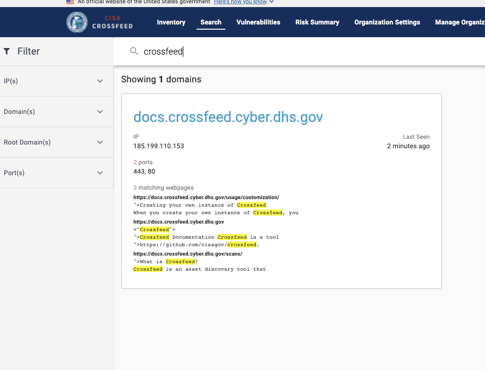

The worker is what runs scans. The code can be found in the `backend` directory.

When running Crossfeed locally, the Elasticsearch cluster is run as the
`crossfeed_es_1` Docker container. When deployed, we run an Elasticsearch cluster managed
by [Amazon Elasticsearch Service](https://aws.amazon.com/elasticsearch-service/).

### Directory structure

The file `tasks/es-client.ts` handles the task of interfacing with the Elasticsearch cluster.

### Configuration

To configure properties for Elasticsearch, you can modify
environment variables in `.env` in the root directory.

If you need to configure Elasticsearch for deployment, you should update the
`env.yml` file. You may also need to update parameters in AWS SSM, as several
environment variables use values that are stored in SSM.

<!-- TODO: document environment variables -->
<!-- Here is a list of all environment variables:

| Name                            | Description                                                               | Sample value                                  |
| ------------------------------- | ------------------------------------------------------------------------- | --------------------------------------------- |
| `REACT_APP_API_URL`             | URL for REST API                                                          | `https://api.staging.crossfeed.cyber.dhs.gov` | -->

### Kibana

[Kibana](https://www.elastic.co/kibana) is a tool that helps visualize and query data that is stored
in Elasticsearch. By default, Kibana is disabled because it adds a lot of overhead to local
development and isn't required for normally running Crossfeed locally.

If you want to view a local version of Kibana (if you, for example, want to inspect the data of the
local Elasticsearch instance), you should first uncomment the "kib" section of `docker-compose.yml`,
re-launch Crossfeed, and then navigate to [http://localhost:5601](http://localhost:5601).

### Syncing with the database

All data is populated to the database by other scans, and synchronization between the database and Elasticsearch is done by the `searchSync` scan.

The `searchSync` scan retrieves all domains / services / vulnerabilities / webpages that need to be synced to Elasticsearch, then bulk
uploads them to Elasticsearch. Afterwards, it sets the `syncedAt` column on these entities so that they will not be synced again in the future,
until they are updated by other scans.

### Indexes and mapping

We use a single index called "domains"; its name might change due to reindexing, so the current name is stored as the DOMAINS_INDEX constant in [es-client.ts](https://github.com/cisagov/crossfeed/blob/b55f36c0808feede82ffd8ad9473b2768e56a511/backend/src/tasks/es-client.ts#L4).

The domain index has a mapping. In order to create or update the mapping, you can run `npm run syncdb` from the `backend` directory. This calls
the `ESClient.syncDomainsIndex()`, which will update the index's mapping if it exists, or create a new index if it doesn't exist.

Both `services` and `vulnerabilities` are stored with the
[nested field type](https://www.elastic.co/guide/en/elasticsearch/reference/7.9/nested.html). This means that they are all stored on the same domain
document, and adding services / vulnerabilities will require updating / reindexing of an entire domain document.

However, `webpages` are stored with the [join field type](https://www.elastic.co/guide/en/elasticsearch/reference/7.9/parent-join.html). This means
that each webpage is stored as a separate document in the "domains" index, but contains a value for the `parent_join` field that indicates that
that webpage is a child of another domain document. This makes it more efficient to add or remove single webpages, since it doesn't require
reindexing all the webpages for a given domain.

So that the webpage fields don't conflict with fields in regular parent domain records, fields in webpage records are stored with the
`webpage_` prefix
([see schema here](https://github.com/cisagov/crossfeed/blob/b55f36c0808feede82ffd8ad9473b2768e56a511/backend/src/tasks/es-client.ts#L11)).

### Building search queries

The search query is built by the [buildRequest](https://github.com/cisagov/crossfeed/blob/33fcaf4cb730974bf3d5ee61b80d13a2c675bd80/frontend/src/pages/Search/SearchProvider/buildRequest.js#L56) function on the frontend. As of now, the logic there roughly corresponds to:

```
(
  (
    (has a domain matching query) OR
    (has a webpage with body matching query)
  )
  AND (matches filters)
)
```

Search results are individual domains, but they may contain snippets of webpage bodies if they contain the webpage content. For example:



### Webpage scraping

Webpage scraping is done by the `webscraper` scan. This scan uses the `scrapy` Python library to follow and scrape all links, observing
rate limits and respecting robots.txt as well.

When a webpage is scraped, basic information such as the URL and status code are stored in the database through the `Webpage` model. However,
webpage contents and headers are not stored in the database; instead, they are directly uploaded to Elasticsearch.
