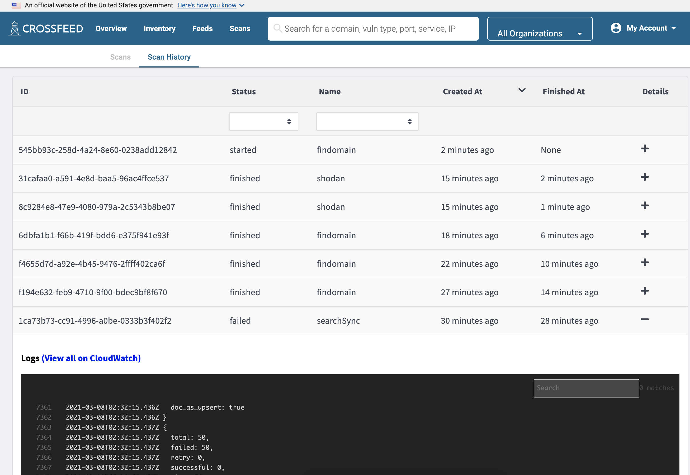

The worker is what runs scans. The code can be found in the `backend` directory.

When running Crossfeed locally, instances of the worker are launched as Docker containers
by the [scheduler](scheduler.md). When deployed, every worker instance is launched as a
Fargate task.

### Directory structure

The `src/tasks` folder contains the code for every scan that the worker supports. `src/worker.ts`
is the main JavaScript entrypoint for the worker, which picks the right scan to run and runs it.

The `Dockerfile.worker` file contains the code required to download the right dependencies
and launch the worker file. It launches `worker/worker-entry.sh`, which sets up MITMProxy
to sign worker requests and then starts the JavaScript worker entrypoint (`src/worker.ts`).

The file `infrastructure/worker.tf` contains the Fargate task definition used to launch
the worker and the ECR repository used to store the worker's built Dockerfile.

The file `tasks/scheduler.ts` handles scheduling workers based on existing Scans that
have been configured on Crossfeed.

The file `tasks/ecs-client.ts` handles the task of actually launching workers,
interfacing with the Docker API (if local) or the AWS ECS API (if launching on Fargate).

### Configuration

To configure properties for the worker, you can modify
environment variables in `.env` in the root directory.

If you need to configure the worker for deployment, you should update the
`env.yml` file. You may also need to update parameters in AWS SSM, as several
environment variables use values that are stored in SSM.

<!-- TODO: document environment variables -->
<!-- Here is a list of all environment variables:

| Name                            | Description                                                               | Sample value                                  |
| ------------------------------- | ------------------------------------------------------------------------- | --------------------------------------------- |
| `REACT_APP_API_URL`             | URL for REST API                                                          | `https://api.staging.crossfeed.cyber.dhs.gov` | -->

### Scheduling

The `Scan` model represents a scheduled scan that is run on all organizations.
A scan can be of multiple types -- for example, `amass` , or `findomain` .

The lambda function `scheduler.ts` goes through each organization and sees which scans
need to be run based on their schedule and when they were last run on a particular organization.

### ScanTask

The `ScanTask` model represents a single scan task on a single organization and stores the status
and errors, if any, of that particular task.

When a scan is run, a `ScanTask` model is created, which launches a Fargate task. When the worker runs, it
connects to the database and updates its ScanTask's status accordingly.

All information needed for the scan (defined in the `CommandOptions` interface) is specified
through the `CROSSFEED_COMMAND_OPTIONS` environment variable. Other secrets needed for the Fargate
task to run are specified in the task configuration through Terraform.

You can view the most recent Scan Tasks, as well as their logs, on the "Scan History" page:



#### ScanTask status reference

- `created` : model is created
- `queued` : Fargate capacity has been reached, so the task will run whenever there is available capacity.
- `requested` : a request to Fargate has been sent to start the task
- `started` : the Fargate container has started running the task
- `finished` : the Fargate container has finished running the task
- `failed` : any of the steps above have failed

### Running scans locally

In order to run scans locally or work on scanning infrastructure,
you will need to set up the Fargate worker and rebuild it periodically
when worker code changes.

#### Building the worker Docker image

Each time you make changes to the worker code, you should run the following command to re-build the worker docker image:

```bash
npm run build-worker
```

#### Running workers locally

To run a worker locally, just create a scan from the Crossfeed UI.
When running locally, the scheduler function runs every 30 seconds, for convenience, so it will
start your worker soon. To manually trigger a run immediately, click on the "Manually run scheduler" button on the Scans page.

Once a worker has started, it is accessible as a running Docker container.
You can examine it by running `docker ps` or ( `docker ps -a | head -n 3` for stopped workers ) to view Docker containers.
and check its logs with `docker logs [containername]` .

You can check the scheduler logs locally by checking the backend container logs.

#### Generating censys types

The `censysIpv4.ts` and `censysCertificates.ts` type files in the `backend/src/models/generated` files have been
automatically generated from Censys's published schemas. If you need to re-generate these type files, run:

```bash
npm run codegen
```
