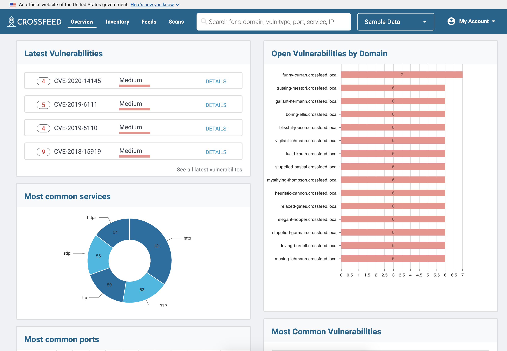

### Accepting an Invite

Standard users of Crossfeed can only access the platform after being invited to
an organization by another user. When invited, you will receive an email invite
to a Crossfeed organization. You will then be prompted to create a user account
with login.gov.

### Overview

Once you are logged in, you can view an overview of your organization's domains here:

<!-- Once you are logged in, you can view the domains of your organization on the
"Dashboard" page. The dashboard shows all domains and subdomains pertaining
to the user's current organization and shows the detected services for each domain. -->
