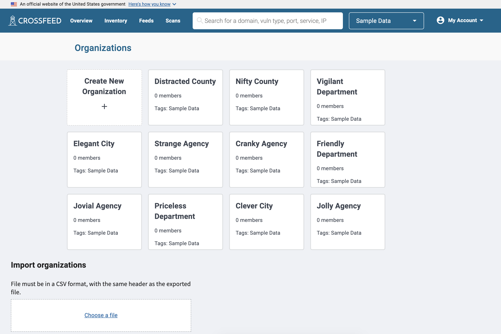
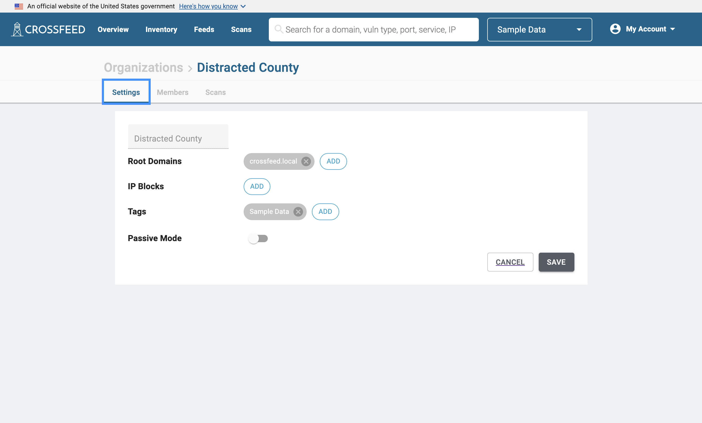
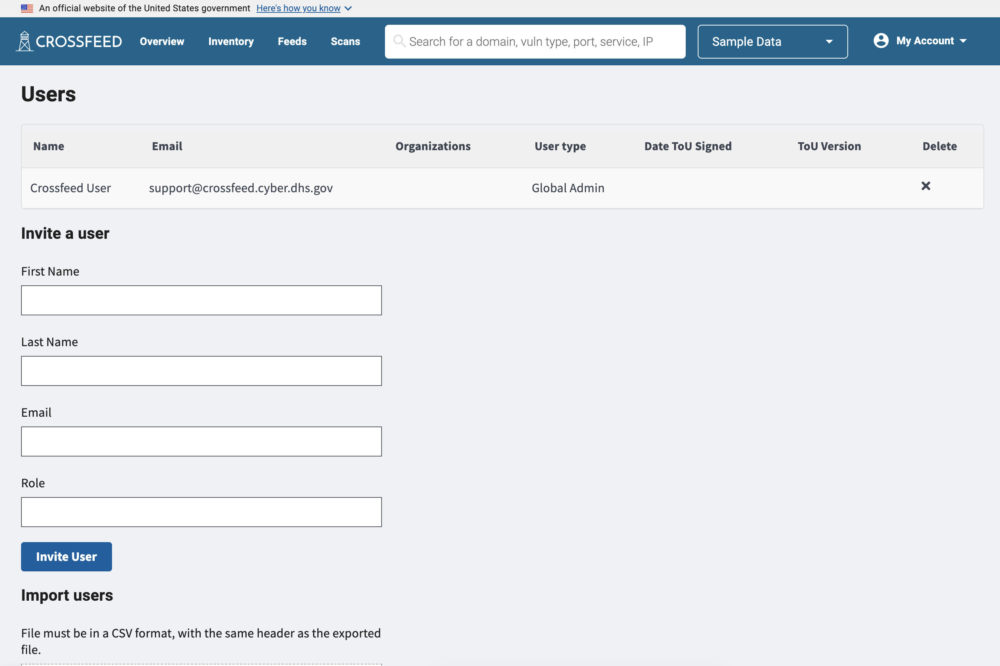
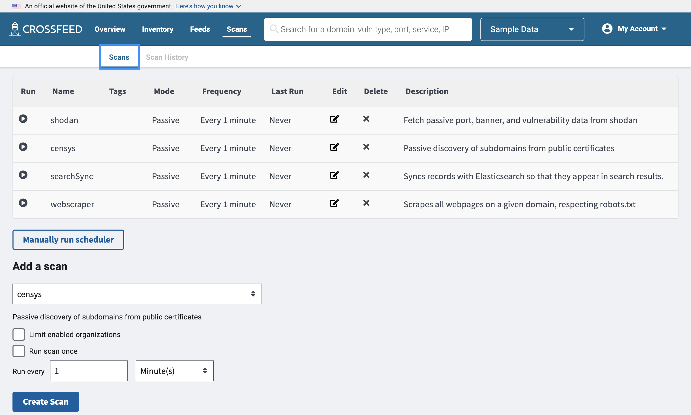

### Management

Administrators have a few additional options for management. All data and users are organized into **organizations** in Crossfeed.

Each organization has a list of root domains configured, which defines the scope of the assets under it, and can have users (with role either `admin` or `user`) assigned to it.

The "Manage Users" screen lets you manage all users who have access to Crossfeed, across all organizations.

Finally, you can view configured scans on the "Scans" tab. These scans allow you to configure the different data sources that feed into Crossfeed.

### Access control

Every user in Crossfeed is one of the following user types:

| User type    | Description                                                                                |
| ------------ | ------------------------------------------------------------------------------------------ |
| Global Admin | Can invite any user, view or edit anything from all organizations                          |
| Global View  | Can view anything from all organizations                                                   |
| Standard     | Can only view / edit entities based on permissions delegated to them for each organization |

Standard users must be assigned a role for each organization that determines what permissions they have. These are the possible roles:

| User role | Description                                                                        |
| --------- | ---------------------------------------------------------------------------------- |
| Admin     | Can invite / remove users, edit domains, schedule scans for their own organization |
| User      | Can only view information for their own organization                               |
