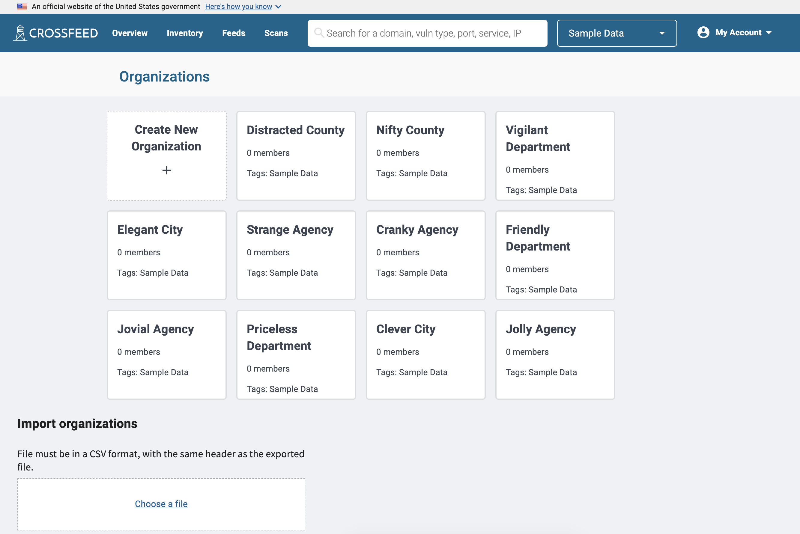

### Accepting an Invite

Standard users of Crossfeed can only access the platform after being invited to
an organization by another user. When invited, you will receive an email invite
to a Crossfeed organization. You will then be prompted to create a user account.

### Overview

Once you are logged in, you can view an overview of your organization's domains
and risk summary on the "Overview" pane.

### View assets

You can search for anything, which returns search results, then filter those results. Each search result represents a domain, which can have ports, products, and vulnerabilities associated with it.

The "All Domains" list contains a more compact representation of all domains.

The "All Vulnerabilities" list has a list of all vulnerabilities. Each vulnerability is associated with a specific domain; vulnerabilities include CVEs as well as other issues such as SSL configuration or misconfiguration errors.

You can also view details of an individual domain.

Finally, you can click on a vulnerability to view more information about it, such as references to links with more information about it, as well as its history and any notes that other Crossfeed users may have added to it.

### Management

Administrators have a few additional options for management. All data and users are organized into **organizations** in Crossfeed.

Each organization has a list of root domains configured, which defines the scope of the assets under it, and can have users (with role either `admin` or `user`) assigned to it.

The "Manage Users" screen lets you manage all users who have access to Crossfeed, across all organizations.

Finally, you can view configured scans on the "Scans" tab. These scans allow you to configure the different data sources that feed into Crossfeed.

<!-- Once you are logged in, you can view the domains of your organization on the
"Dashboard" page. The dashboard shows all domains and subdomains pertaining
to the user's current organization and shows the detected services for each domain. -->
