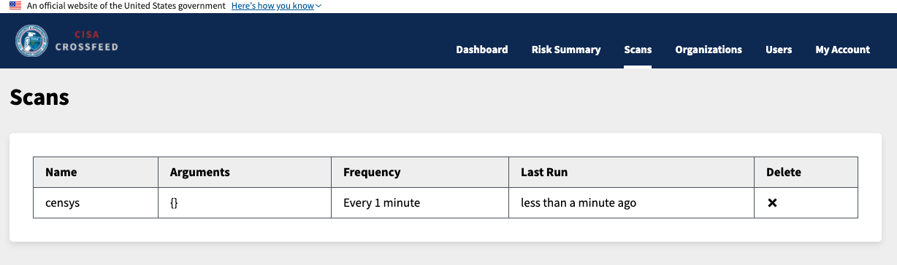

# Worker architecture

The `Scan` model represents a scheduled scan that is run on all organizations.
A scan can be of multiple types -- for example, `amass`, or `findomain`.

First, add an organization:

Then, add a scan:

## Scheduling

The lambda function `scheduler.ts` goes through each organization and sees which scans
need to be run based on their schedule and when they were last run on a particular organization.

## Running

When a scan is run, a `ScanTask` model is created, which launches a Fargate task.

All information needed for the scan (defined in the `CommandOptions` interface) is specified
through the `CROSSFEED_COMMAND_OPTIONS` environment variable. Other secrets needed for the Fargate
task to run are specified in the task configuration through Terraform.

The entry point for the Fargate task is at `backend/src/worker.ts`.

### Local runs

When running Crossfeed locally, each worker is launched through a Docker container instead.

To inspect tasks that are running (and have recently finished), do `docker ps -a > out` and inspect the contents of `out`:

Note that each Docker container is identified by organization name and scan name.

To view the logs of a particular Docker container, you can run `docker logs crossfeed_worker_cisa_censys_8358453`.

## ScanTask

The `ScanTask` model represents a single scan task on a single organization and stores the status
and errors, if any, of that particular task.

You can view the most recent Scan Tasks on the organization page:

### ScanTask status reference

* `created`: model is created
* `requested`: a request to Fargate has been sent to start the task
* `started`: the Fargate container has started running the task
* `finished`: the Fargate container has finished running the task
* `failed`: any of the steps above have failed

## Fargate vs Lambda

Each scan specifies whether it should run on Fargate or Lambda in the `SCAN_SCHEMA` variable,
which is defined in `backend/src/api/scans.ts`.

Changing a scan from Fargate to Lambda, or vice versa, does not require any code change of the
handler itself; it just requires deployment of the appropriate function in the `tasks.yml` file.

Note that currently, although switching a task to Lambda will work, updating the `ScanTask` status
has not yet been implemented for Lambda tasks. This is why all tasks are using Fargate.